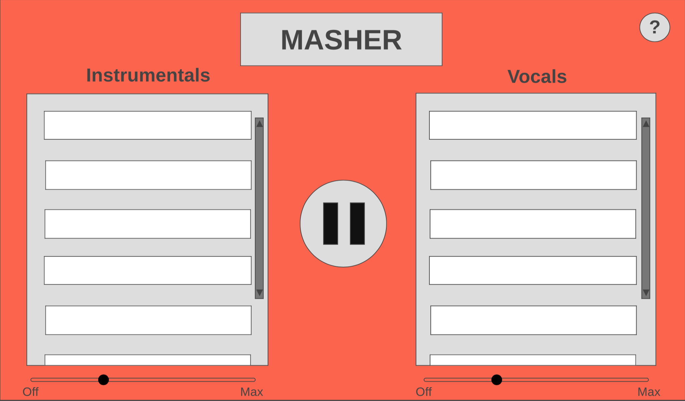
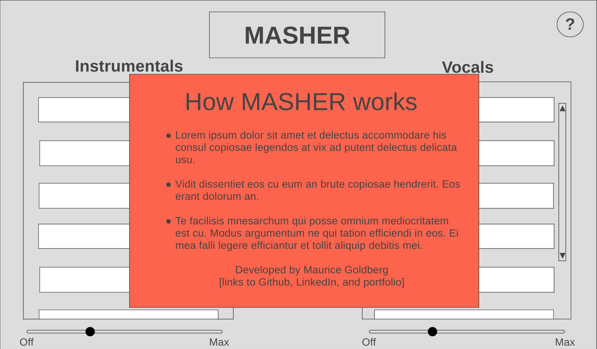

# MASHER

## Background
*MASHER* is an interface that allows users to experience the joy of one of music's underappreciated genres: the mash-up. MASHER uses a pre-assembled set of audio files to create song mash-ups, giving the user complete control over which combinations of songs they wish to combine. With a total of 64 possible song mash-ups combining songs from a wide array of genres, the user can have endless fun frankensteining modern classics like Justin Bieber's "Where Are U Now" with canonical pop oldies such as Prince's "I Would Die 4 U."

For further information on the MASHER UI and its design details, please refer to the MVPs and Wireframes sections below. 

## MVPs
### Core functionality
1. Create 8 isolated track stems each for vocals and instrumentals columns
2. Play/pause button
Plays and pauses audio tags all at once
Toggles play and pause symbol
3. Track toggle functionality
Unmutes track when clicked, muting all other tracks in column
Shows track selection in column, unselecting previously selected track
4. All audio tags continuously loop
5. Faders for each column that raises and lowers volume for all of column's audio tags
6. Color of background changes depending on the color combinations pressed (use a hex-combining alg)
7. An about modal describes how MASHER works and show on hover over question mark

## Design structure
The MASHER interface contains two columns: vocals and instrumentals. Only one audio track can play from each column at a time, so only two tracks can be mashed up at once. A sound-on/mute button exists in the middle of the screen. A modal also appears when the user clicks the question mark in the top-right of the screen.

## Architecture and Technologies
MASHER uses the following technologies:
- Web Audio API for audio controls
- Vanilla Javascript, HTML, and CSS for all visual elements of the user interface
